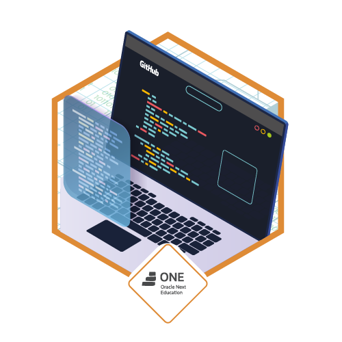
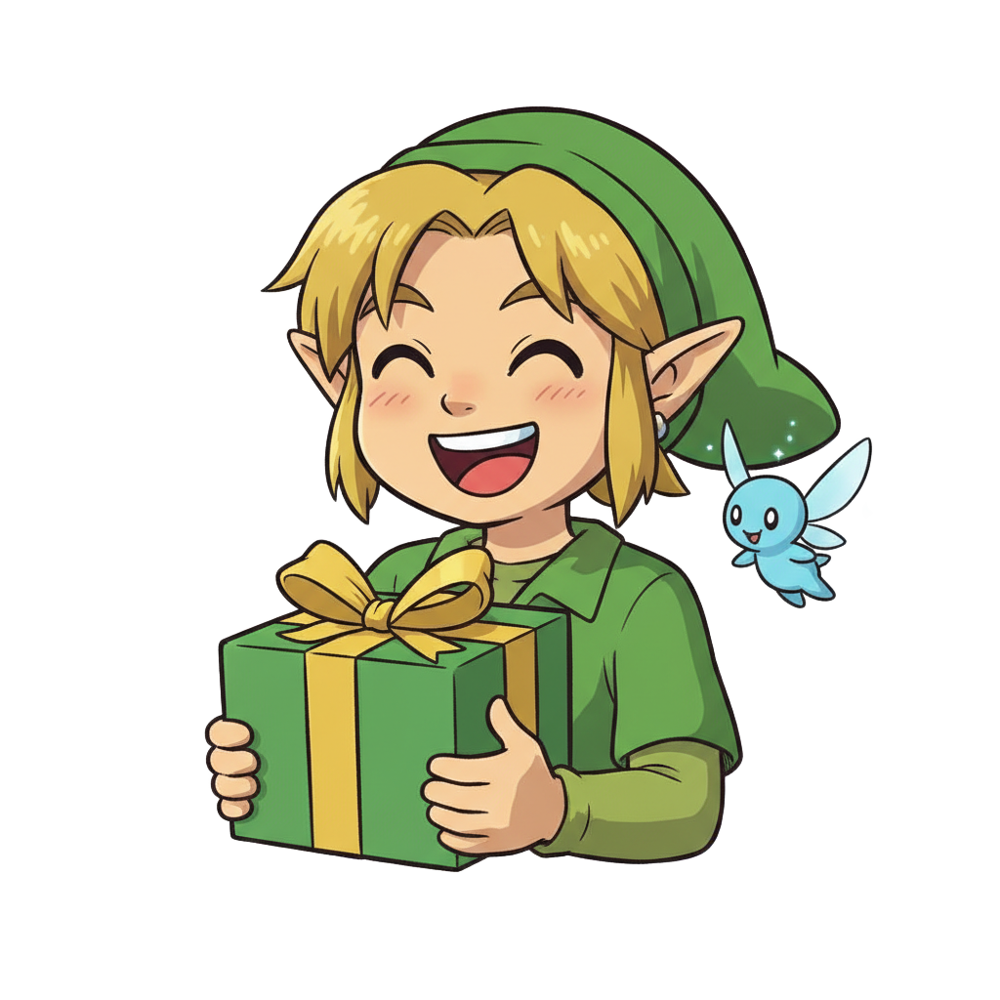

# 🎁 Desafio: Amigo Secreto — Oracle Next Education (ONE)

[]()
[]()
[]()
[]()
[]()



> Projeto desenvolvido como parte da Formação Iniciante em Programação do programa Oracle Next Education (ONE), em parceria com a [Alura](https://www.alura.com.br/).

---



## 📌 Sobre o Projeto

O objetivo deste desafio é fortalecer a lógica de programação com JavaScript construindo uma aplicação simples de sorteio de “amigo secreto”. O usuário digita nomes, adiciona à lista e sorteia um nome aleatório — com direito a um pequeno efeito visual de confete ao finalizar o sorteio.

- Adição de amigos à lista com validação.
- Exibição dinâmica dos nomes inseridos.
- Sorteio aleatório com feedback visual e mensagem de resultado.
- Toques de acessibilidade com `aria-live` e rótulos descritivos.

---

## 🧠 Tecnologias e Conceitos

- HTML semântico
- CSS (variáveis, layout flex e animações)
- JavaScript (DOM, arrays, eventos, `Math.random`)
- Acessibilidade básica (atributos ARIA)

---

## ▶️ Como Executar

Você pode abrir o projeto diretamente no navegador, acessando [esse link](http://amigo-secreto-challenge-one-ggfo.s3-website-us-east-1.amazonaws.com/)

---

## 🕹️ Como Usar

1. Digite o nome de um amigo no campo de texto.
2. Clique em “Adicionar” para incluir o nome na lista.
3. Repita para quantos amigos quiser (mínimo 2 para sortear).
4. Clique em “Sortear amigo” para exibir o resultado.

Observações:

- Após o sorteio, a lista é limpa automaticamente.
- O botão de sortear ativa uma pequena animação de confete por 2 segundos.

---

## 📂 Estrutura do Projeto

```
Amigo_Secreto-Challenge/
├─ index.html
├─ style.css
├─ app.js
└─ assets/
   ├─ amigo-secreto.png
   └─ play_circle_outline.png
```

---

## ✅ Requisitos Atendidos

- [x] Capturar nomes digitados e armazenar em lista (array)
- [x] Exibir a lista de amigos na tela
- [x] Sortear um amigo aleatoriamente
- [x] Exibir resultado com feedback visual (confete)
- [x] Resetar a lista após o sorteio

---

## 🚀 Próximos Passos (Ideias de Melhoria)

- [ ] Impedir nomes duplicados e tratar espaços em branco
- [ ] Remover nomes individualmente e “limpar lista”
- [ ] Sortear pares (mapeamento completo) sem repetir pessoas
- [ ] Persistência no `localStorage`
- [ ] Testes unitários simples para funções de sorteio/validação
- [ ] Tema claro/escuro e melhorias de acessibilidade

---

## 🧩 ONE — Sobre a Formação

O Oracle Next Education (ONE) é um programa de impacto social da Oracle, em parceria com a Alura, voltado a capacitar novos talentos em tecnologia e conectá-los ao mercado. A formação conta com trilhas como Lógica de Programação, Front-End/Back-End, Banco de Dados, Soft Skills e desafios práticos como este projeto.

Saiba mais em: https://www.alura.com.br/oracle-one

---

## ✍️ Autor

Feito por [@gustavfaustino](https://github.com/gustavfaustino) com muita curiosidade, aprendizado contínuo e um pouco de confete. 😉
